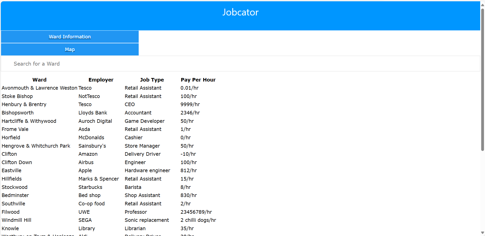
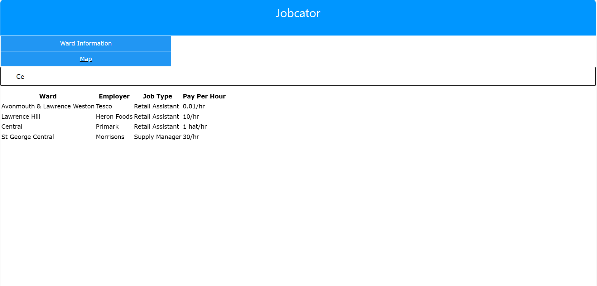
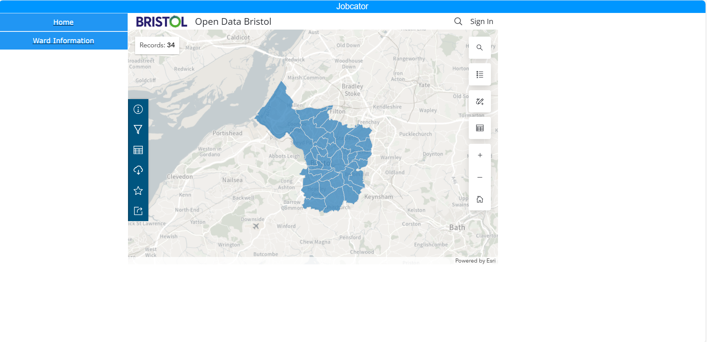

# Deployment

## Release Notes
TODO: Describe the current version of the system (with version number. Include system dependencies ands software tools used.
Are there any known issues? 
Describe the deployment of software components to hardware nodes using a UML Deployment diagram.
#### Jobcator
Version number: v1.0.0
  <b>System dependencies</b>: [Open Data Bristol Map](https://arcg.is/08yDOj0)
  <b>Software tools used</b>: Visual Studio Code(For HTML, CSS and JavaScript), Astah UML(For the UML diagrams), Draw.io(For the UML Class Diagram)
  <b>Issues identified</b>: Employers can not post job adverts because this feature is not implemented; Finding user location is not available because the application does not ask you for your geolocation data; 

Deployment diagram:

# User guide
TODO: Explain how each use-case works by providing step-by-step screenshots for each use-case. This should be based on a tested scenario.

### Use Case 1
1. Home page: The first thing the employees see when they load the page is a table with a range of jobs, all of them in the Bristol area; if they want to find a more specific job they can filter the table using the search bar above the table to search for a specific ward.
 

2. Map: If the employees want to see where a ward is located they can click on the button called Map which will display a map of all the Bristol wards.

### Use Case 2
