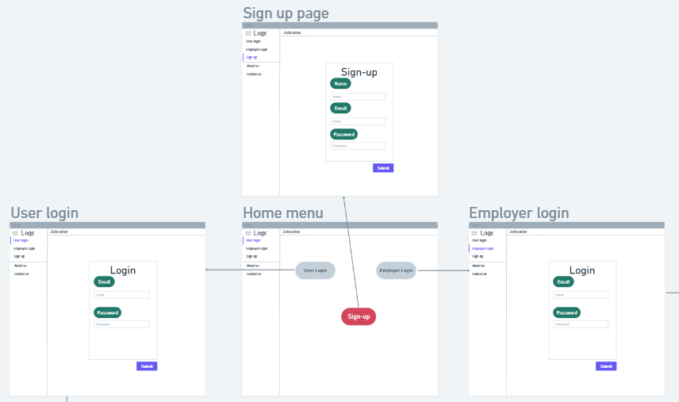
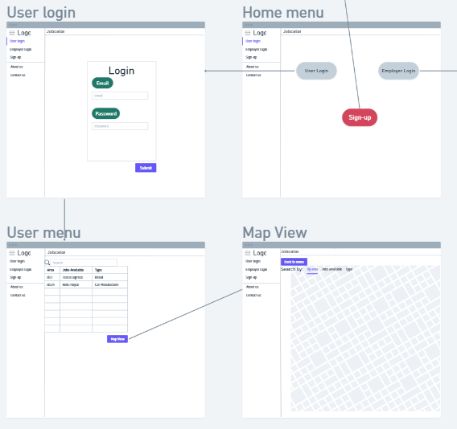
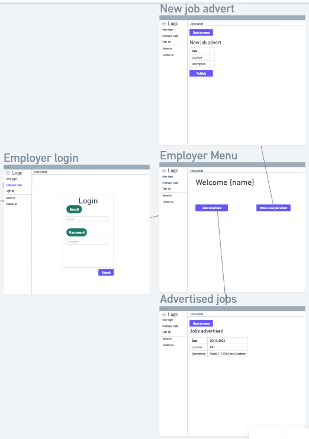
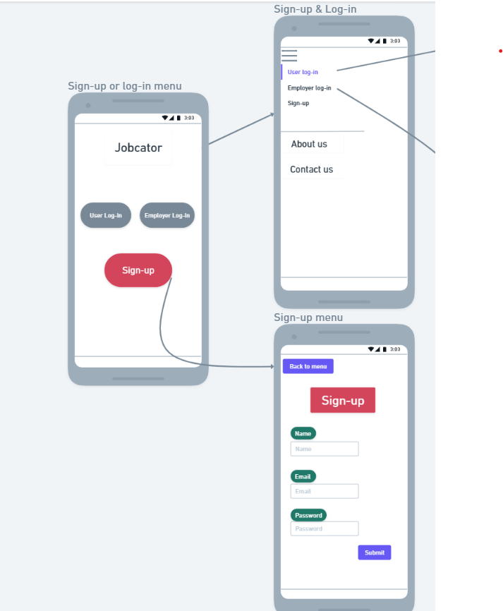
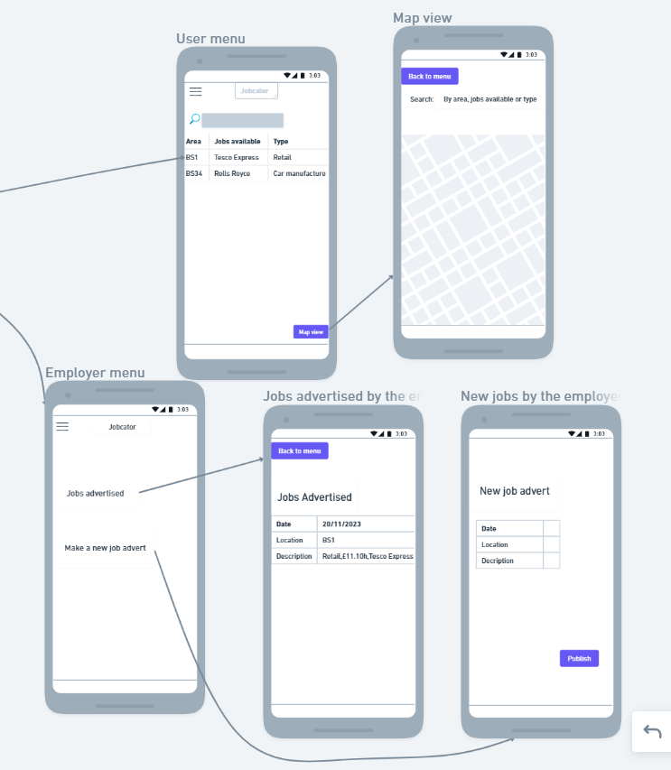

# Design

## User Interface design

This is the design of the app, on both desktop and mobile. They function the same way as each other. It is designed to be easy to use and to easily allow users to view job adverts.

### Desktop View

This is how the app would look on a desktop device, such as a PC or laptop. The home page contains links to the log in and sign up pages. Once logged in, the user is automatically redirected to the respective profile pages of whatever type of user they have logged in as. This design was made by Arafat.

### Mobile View

This is how the app would look on a mobile device. It works the exact same as the desktop version. This design was made by Jaime.

## Database hosting
In order to allow users to create accounts, database hosting will be required. In order to do this, supabase, a database hosting service will be used.
