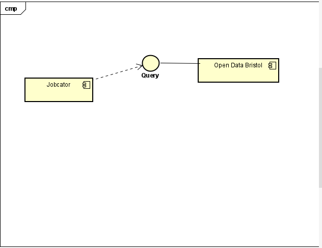
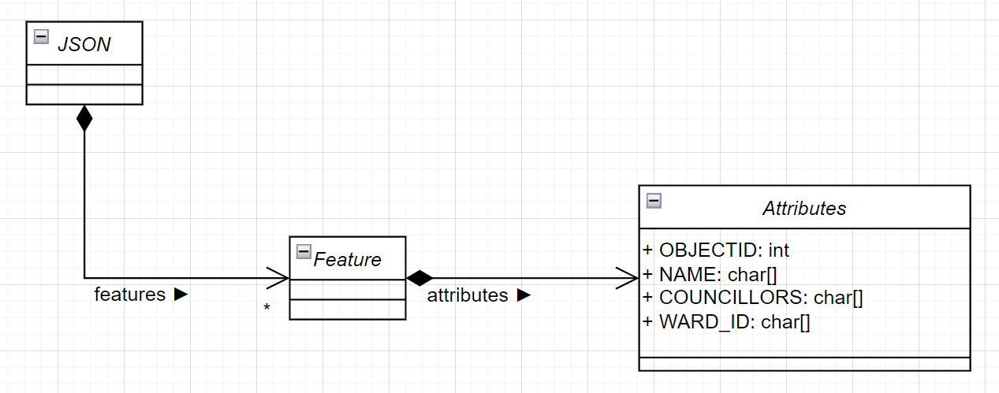

# Implementation

## Introduction
The dataset shows wards in Bristol and information on them. The system uses this information to display available jobs in each ward. However, the jobs shown are currently fakes that are meant to be a proof of concept. Users can view a map of the Bristol with each ward highlighted.

## Project Structure
**home.html** is the main menu and where the job adverts are, **map.html** is also embedded into **home.html** as a button which shows a map of Bristol with the wards highlighted. **style.css** contains the CSS for the website and **Jobcator.hmtl** contains table displaying ward information, consisting of the names of each ward, number of councillors and the ward ID.
```
└── 📁Jobcator
    └── home.html
    └── Jobcator.html
    └── map.html
    └── style.css
```

```
└── 📁docs
    └── 📁 images
    └── context_diagram.jpg
    └── deployment.md
    └── design.md
    └── implementation.md
    └── planning.md
    └── requiements.md
    └── testing.md
```

## Code linting

ESLint was used to lint the JavaScript code.

1. "i" is not defined: can be resolved by using var or let
2. "tr" is not defined, "document" is not defined: they are pre defined in visual studio, but ESLint does not know this
3. "query" is defined but never used: it is used in the html file, but not in any JavaScript functions
4. "fetch" is not defined: Again, it is defined, but ESLint doesn't know

## Software Architecture

This website uses Bristol Open Data to display the map using the "Map" button in home.html. In addition, it uses Bristol Open Data to fetch data from the dataset used.

Component diagram:



## Bristol Open Data API

This website queries Bristol Open Data and fetches the NAME, COUNCILLORS, and WARD_ID fields from the Wards dataset.

UML class diagram:


